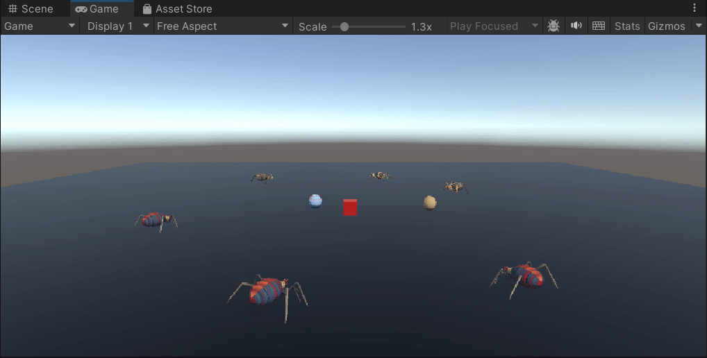
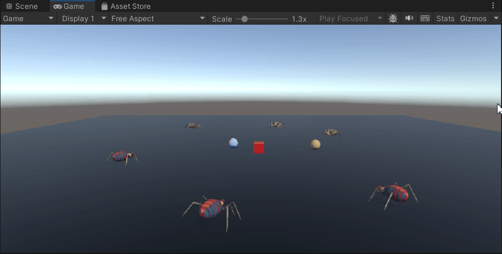
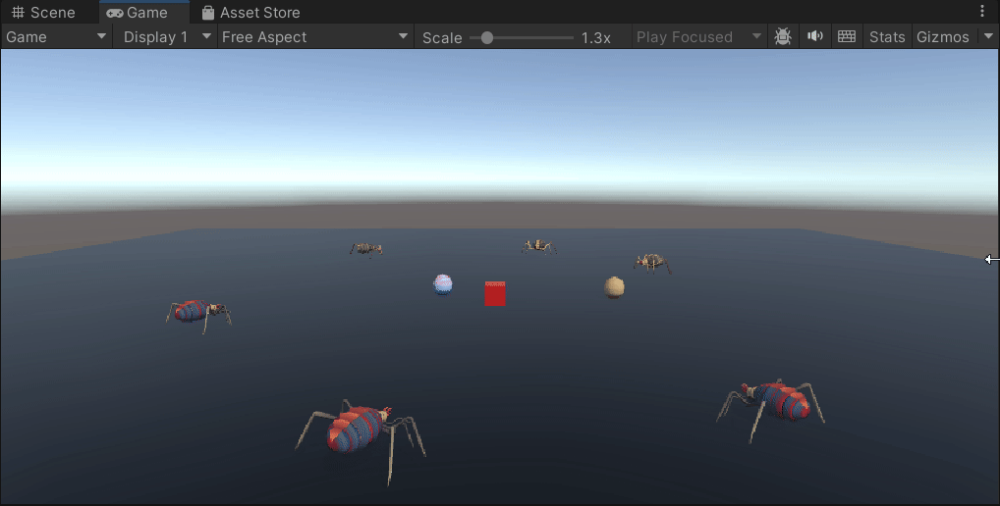
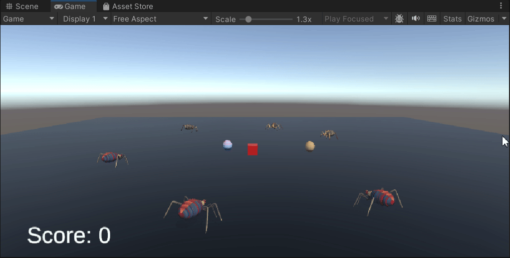
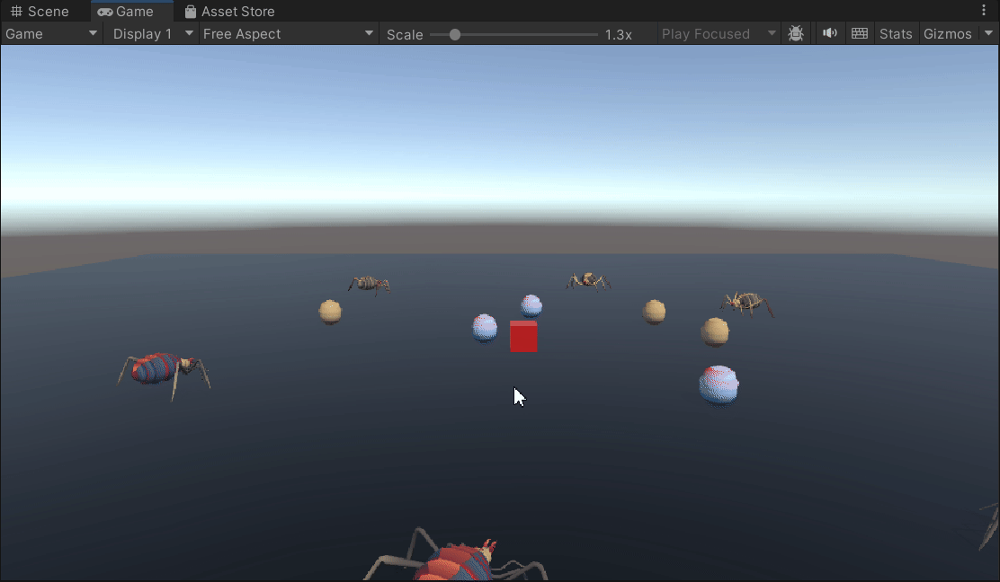

# Delegados-y-Eventos

## Escena 1
Las arañas de tipo 1 se giran y caminan hacia una araña seleccionada de tipo 2 y las arañas de tipo 2 se giran hacia el huevo de color gris.

## Escena 2
Las arañas de tipo 1 se giran hacia el huevo de color rojo y caminan hacia él y las arañas de tipo 2 se giran hacia el huevo de color gris

## Escena 3
Cuando el cubo toca con el huevo de color rojo, las arañas de tipo 1 se teletransportan hacia el objetivo, en este caso hacia el huevo de color rojo. Las arañas de tipo 2 se giran hacia e huevo de color gris

## Escena 4
Cuando el cubo toca una araña de tipo 1, el marcador sube en 5 puntos mientras que si el cubo toca una araña de tipo 2 el marcador sube 10 puntos.

## Modificación
Cuando el cubo toca un huevo, la araña que esta asignada a ese huevo se teletransporta a un punto que yo he marcado como referencia y la vida del cubo aumenta en 1.

## Problemas
En la escena 1 y la escena 2, tuve un problema que no supe arreglar ya que tengo un debugger que me muestra el mensaje por consola que la araña esta en movimiento hacia el objetivo, pero realmente la araña esta quieta y no supe camina.
